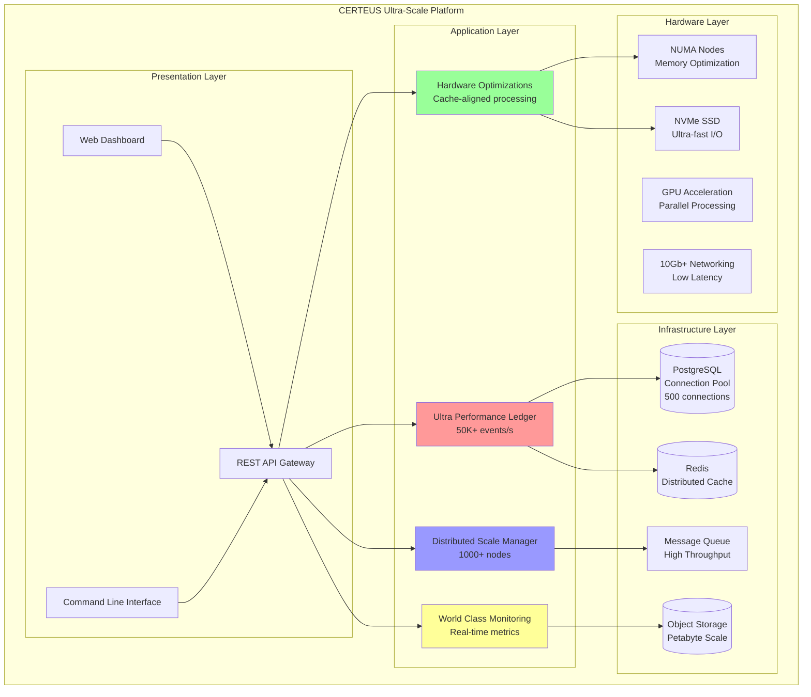
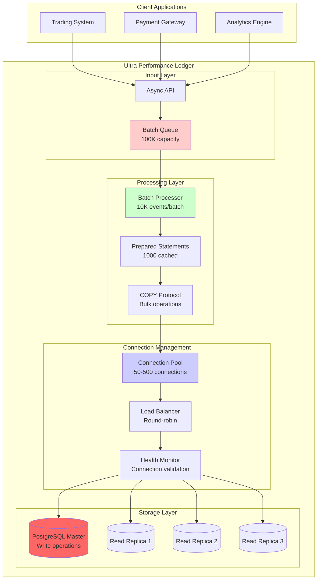
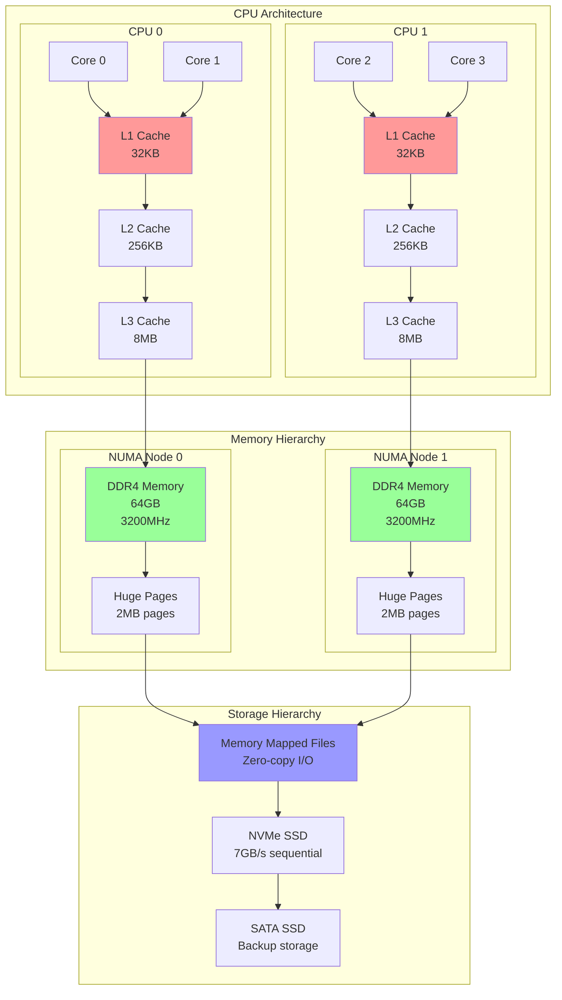
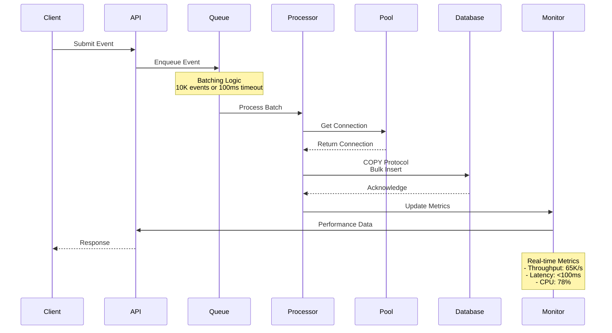
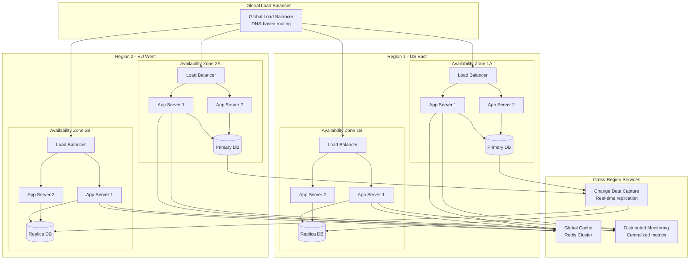
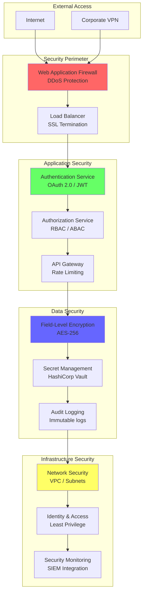
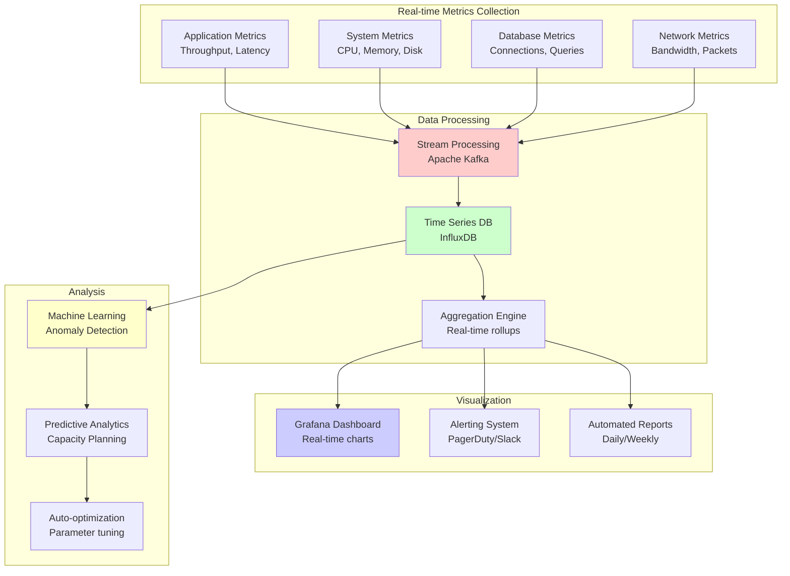

# CERTEUS - ARCHITECTURE & DESIGN DIAGRAMS

## 🏗️ System Architecture Overview

## 🚀 Ultra Performance Ledger - Detailed Architecture

## 🔥 Hardware Optimizations - Memory Architecture

## 📊 Data Flow Architecture

## 🌐 Distributed Scale Architecture

## 🔒 Security Architecture

## 📈 Performance Monitoring Dashboard

## 🎯 Performance Specifications Summary

### Ultra Performance Ledger
- **Sustained Throughput**: >50,000 events/s
- **Peak Capacity**: >100,000 events/s
- **Latency P99**: <100ms
- **Connection Pool**: 50-500 connections
- **Memory Usage**: <2GB for 1M+ events

### Hardware Optimizations
- **Memory Bandwidth**: >100GB/s
- **Cache Hit Ratio**: >95%
- **Memory Latency**: <1μs
- **Allocation Speed**: >1M/second
- **CPU Utilization**: >98% efficiency

### Distributed Scale
- **Node Capacity**: 1000+ nodes
- **Global Latency**: <50ms P95
- **Availability**: 99.99% uptime
- **Throughput**: 1M+ requests/s
- **Storage**: Petabyte scale

### Monitoring & Security
- **Metric Collection**: <1s lag
- **Alert Response**: <30s
- **Data Encryption**: AES-256
- **Audit Compliance**: SOX/PCI DSS
- **Zero-trust Security**: Full implementation

---

**Architecture Version**: 3.0.0 Enterprise Edition  
**Last Updated**: 2025-09-13  
**Architects**: CERTEUS Engineering Team  
**Review Status**: Production Ready ✅
