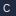

# CERTEUS 

[](https://github.com/CERTEUS/certeus/actions/workflows/tests.yml)
[](https://github.com/CERTEUS/certeus/actions/workflows/proof-gate.yml)
[](https://github.com/CERTEUS/certeus/actions/workflows/smoke.yml)
[](https://github.com/CERTEUS/certeus/actions/workflows/smoke.yml)
[](https://github.com/CERTEUS/certeus/actions/workflows/openapi-pages.yml)
[](https://github.com/CERTEUS/certeus/actions/workflows/openapi-diff.yml)
[](https://github.com/CERTEUS/certeus/actions/workflows/gauge_gate.yml)
[](https://github.com/CERTEUS/certeus/actions/workflows/path_coverage_gate.yml)
[](https://github.com/CERTEUS/certeus/actions/workflows/boundary_rebuild_gate.yml)
[](https://github.com/CERTEUS/certeus/security/policy)
[](#versioning-deprecation-support)
[](https://slsa.dev)
[](https://securityscorecards.dev/)
[](LICENSE)
[Roadmap](docs/ROADMAP.md)
[](https://github.com/CERTEUS/certeus/actions/workflows/ci_public.yml)

<p align="center">
  <picture>
    <source media="(prefers-color-scheme: dark)" srcset="docs/assets/brand/certeus-banner-dark.png">
    <source media="(prefers-color-scheme: light)" srcset="docs/assets/brand/certeus-banner-light.png">
    
  </picture>
</p>

> **Proof-native system dla dowodów, decyzji i modeli.** Rdzeń _niezmienialny_ (PCO/Boundary), wszystko inne – _wtyczki_ i _polityki_.
>
> **Fizyka sensu:** CFE (geometria), lexqft (ścieżki), QTMP (pomiar). **Interfejsy 1. klasy:** MailOps, ChatOps.
> (Technikalia: Manifest Jednolity v1.5 w `docs/manifest.md`.)

---

## Spis treści

- [Dlaczego CERTEUS?](#dlaczego-certeus)
- [Architektura (1 obraz)](#architektura-1-obraz)
- [Szybki start (Dev/SRE/Audytor)](#szybki-start-devsreaudytor)
- [ChatOps — pierwsza komenda](#chatops--pierwsza-komenda)
- [MailOps — ingest i PFS://](#mailops--ingest-i-pfs)
- [Cookbooki domenowe](#cookbooki-domenowe)
- [API — 10 najważniejszych endpointów](#api--10-najważniejszych-endpointów)
- [Gwarancje i bramki CI/SLO](#gwarancje-i-bramki-cislo)
- [Bezpieczeństwo & łańcuch dostaw](#bezpieczeństwo--łańcuch-dostaw)
- [Observability & Runbooks](#observability--runbooks)
- [Operational Playbook](#operational-playbook)
- [Diagrams](#diagrams)
- [Security Policy](#security-policy)
- [Pre-release Checklist](#pre-release-checklist)
- [OpenAPI & SDK](#openapi--sdk)
- [Konfiguracja / ENV](#konfiguracja--env)
- [Struktura repo](#struktura-repo)
- [Standard kodowania](#standard-kodowania)
- [Brand & Assets](#brand--assets)
- [Versioning, Deprecation, Support](#versioning-deprecation-support)
- [FAQ](#faq)
- [Glosariusz](#glosariusz)
- [Licencja](#licencja)

---

## Dlaczego CERTEUS?

- **Proof-Only I/O**: każdy wynik publikowalny musi nieść **PCO** (Proof-Carrying Output); inaczej — **DROP**.
- **Boundary = audyt natychmiastowy**: stan systemu rekonstruowalny z „brzegu” (append-only), docelowo `delta_bits == 0`.
- **Fizyka sensu**: CFE/lexqft/QTMP zamiast „heurystyk”. Geodezyjny dowód, horyzont zdarzeń evidencyjnych, nieoznaczoność operatorów.
- **Modułowość**: _Domain Packs_ (Prawo/Finanse/Kod/Sec/Med), _Devices_ (HDE/Q-Oracle/Entangler/Chronosync).
- **Enterprise**: PQ-crypto (Ed25519 + ML-DSA), FROST 2-z-3, SLSA/in-toto/SBOM, TEE (Bunkier).

---

## Architektura (1 obraz)

```
Core → Services → Modules → Plugins (Domain Packs) → Clients → Infra
```

- **Core**: Truth Engine, PCO SDK, Crypto, Contracts
- **Services**: ProofGate, Ledger, Boundary, Context Forge, MailOps, ChatOps
- **Modules**: CFE, lexqft, QTMP, ethics (Equity-Meter/HHE)
- **Plugins**: packs-law / packs-fin / packs-code / packs-sec / packs-med
- **Clients**: CERT-Cockpit (Web/Desktop/Mobile)
- **Infra**: CI/SLO-Gates, k8s, OTel, Grafana

> Szczegóły: patrz „Manifest v1.5” w `docs/manifest.md`.

---


## 60 seconds: run and check

- Linux/macOS
```
python -m venv .venv && source .venv/bin/activate
source ./scripts/dev_env.sh
python -m pip install -U pip wheel setuptools ruff pytest jsonschema cryptography fastapi uvicorn prometheus-client python-multipart z3-solver -c constraints/requirements-constraints.txt
python -m uvicorn services.api_gateway.main:app --host 127.0.0.1 --port 8000
# in another terminal
curl -s http://127.0.0.1:8000/health
```

- Windows (PowerShell)
```
py -3.11 -m venv .venv; .\\.venv\\Scripts\\Activate.ps1
$py = ".\\.venv\\Scripts\\python.exe"
. .\\scripts\\dev_env.ps1
& $py -m pip install -U pip wheel setuptools ruff pytest jsonschema cryptography fastapi uvicorn prometheus-client python-multipart z3-solver -c constraints/requirements-constraints.txt
& $py -m uvicorn services.api_gateway.main:app --host 127.0.0.1 --port 8000
# in another terminal
curl.exe -s http://127.0.0.1:8000/health
```
## 60 sekund: uruchom i sprawdź

- Linux/macOS
```
python -m venv .venv && source .venv/bin/activate
source ./scripts/dev_env.sh
python -m pip install -U pip wheel setuptools ruff pytest jsonschema cryptography fastapi uvicorn prometheus-client python-multipart z3-solver -c constraints/requirements-constraints.txt
python -m uvicorn services.api_gateway.main:app --host 127.0.0.1 --port 8000
# w drugim oknie
curl -s http://127.0.0.1:8000/health
```

- Windows (PowerShell)
```
py -3.11 -m venv .venv; .\\.venv\\Scripts\\Activate.ps1
$py = ".\\.venv\\Scripts\\python.exe"
. .\\scripts\\dev_env.ps1
& $py -m pip install -U pip wheel setuptools ruff pytest jsonschema cryptography fastapi uvicorn prometheus-client python-multipart z3-solver -c constraints/requirements-constraints.txt
& $py -m uvicorn services.api_gateway.main:app --host 127.0.0.1 --port 8000
# w drugim oknie
curl.exe -s http://127.0.0.1:8000/health
```
## Szybki start (Dev/SRE/Audytor)

> Ustal bazowy adres usług:

```bash
export CER_BASE="http://localhost:8000"
```

### Dev (lokalnie)

```bash
# Linux/macOS (Python 3.11)
python -m venv .venv && source .venv/bin/activate
source ./scripts/dev_env.sh
python -m pip install -U pip wheel setuptools ruff pytest jsonschema cryptography fastapi uvicorn prometheus-client python-multipart z3-solver -c constraints/requirements-constraints.txt
python -m ruff check . --fix && python -m ruff format .
python -m pytest -q

# API Gateway (DEV)
python -m uvicorn services.api_gateway.main:app --host 127.0.0.1 --port 8000

# (Opcjonalnie) ProofGate lokalnie
python -m uvicorn services.proofgate.app:app --host 127.0.0.1 --port 8085
```

```powershell
# Windows PowerShell (Python 3.11)
py -3.11 -m venv .venv; .\.venv\Scripts\Activate.ps1
$py = ".\.venv\Scripts\python.exe"
. .\\scripts\\dev_env.ps1
& $py -m pip install -U pip wheel setuptools ruff pytest jsonschema cryptography fastapi uvicorn prometheus-client python-multipart z3-solver -c constraints/requirements-constraints.txt
& $py -m ruff check . --fix; & $py -m ruff format .
& $py -m pytest -q --junitxml="reports\junit.xml"

# API Gateway (DEV)
& $py -m uvicorn services.api_gateway.main:app --host 127.0.0.1 --port 8000

# (Opcjonalnie) ProofGate lokalnie
& $py -m uvicorn services.proofgate.app:app --host 127.0.0.1 --port 8085
```

### Dev stack (Docker Compose)

```bash
make run-stack   # start API+ProofGate+Prometheus+Grafana
make smoke       # szybki smoke test E2E
make down-stack  # zatrzymaj stack
```

Grafana: http://localhost:3000 (admin/admin), Prometheus: http://localhost:9090.


### SRE (k8s)

```bash
kubectl apply -f infra/k8s/core.yaml
kubectl apply -f infra/k8s/services.yaml
kubectl apply -f infra/k8s/ingress.yaml
```

### Audytor (weryfikacja PCO)

```bash
cerctl ledger get CER-1 | jq '.proof, .claims[0]'
cerctl boundary reconstruct --date 2025-08-30
```

---

## ChatOps - pierwsza komenda

```bash
curl -sX POST "$CER_BASE/v1/chatops/command"   -H 'Content-Type: application/json'   -d '{ "cmd":"cfe.geodesic --case CER-42", "text_context":"demo" }' | jq
# oczekiwane: {"result":{...},"pco":{...}}
```

### Packs — szybki przykład

```bash
curl -sX GET "$CER_BASE/v1/packs" | jq
curl -sX POST "$CER_BASE/v1/packs/handle" \
  -H 'Content-Type: application/json' \
  -d '{
    "pack":"plugins.packs_fin.fin_alpha:PACK",
    "kind":"fin.alpha.measure",
    "payload":{"risk":0.10, "sentiment":0.55}
  }' | jq
```

### FINENITH — minimalne zapytania

```bash
curl -sX POST "$CER_BASE/v1/fin/alpha/measure" -H 'Content-Type: application/json' -d '{"signals":{"risk":0.1,"sentiment":0.6}}' | jq
curl -sX GET  "$CER_BASE/v1/fin/alpha/uncertainty" | jq
curl -sX GET  "$CER_BASE/v1/fin/alpha/entanglements" | jq
```

## MailOps — ingest i PFS://

```bash
curl -sX POST "$CER_BASE/v1/mailops/ingest"   -H 'Content-Type: application/json'   -d '{
  "mail_id":"MID-1", "thread_id":"T-1",
  "from_addr":"a@ex.com", "to":["b@ex.com"],
  "subject":"Hello", "body_text":"Hi", "spf":"pass", "dkim":"pass", "dmarc":"pass",
  "attachments":[{"filename":"a.pdf","content_type":"application/pdf","size":1234}]
}' | jq
# Załącznik dostępny jako pfs://mail/<messageId>/<attachment>
```

---

## Cookbooki domenowe

### Prawo (LEXENITH)

```bash
# Geodezyjny dowód
curl -sX POST "$CER_BASE/v1/cfe/geodesic" -d '{"case":"CER-LEX-7"}' | jq
# Horyzont zdarzeń dowodowych (lock)
curl -sX POST "$CER_BASE/v1/cfe/horizon" -d '{"case":"CER-LEX-7"}' | jq
```

### Finanse (FINENITH „Quantum Alpha”)

```bash
# Pomiar na superpozycji (R/S operators)
curl -sX POST "$CER_BASE/v1/fin/alpha/measure" -d '{"pair":"BTC/USD"}' | jq
# Splątania aktywów
curl -s "$CER_BASE/v1/fin/alpha/entanglements" | jq
```

### Security (ProofFS / artefakty)

```bash
# Montaż pfs:// tylko-do-odczytu (kontener sidecar lub host)
# przykładowy skrypt: scripts/prooffs/mount_ro.sh (placeholder)
```

---

## API — 10 najważniejszych endpointów

```text
POST /v1/proofgate/publish          # decyzja publikacji + PCO + wpis do ledger
GET  /v1/ledger/{case_id}           # odczyt public payload
GET  /v1/packs                      # lista Domain Packs (ABI/capabilities)
POST /v1/packs/handle               # wywołanie pack.handle(kind,payload)
POST /v1/fin/alpha/measure          # FINENITH: pomiar Alpha
GET  /v1/fin/alpha/uncertainty      # FINENITH: dolna granica niepewności
GET  /v1/fin/alpha/entanglements    # FINENITH: splątania (MI)
POST /v1/cfe/geodesic               # geodezyjny dowód (CFE)
POST /v1/cfe/horizon                # horyzont zdarzeń dowodowych (CFE)
POST /v1/qtm/measure                # kolaps funkcji falowej (QTMP)
POST /v1/lexqft/tunnel              # tunelowanie dowodowe
GET  /v1/lexqft/coverage            # gamma pokrycia ścieżek + uncaptured mass
GET  /v1/lexqft/coverage            # gamma pokrycia ścieżek + uncaptured mass
POST /v1/mailops/ingest                # ingest e-maila → Evidence DAG/PFS
POST /v1/chatops/command            # komenda tekstowa → wywołanie usług
POST /v1/devices/horizon_drive/plan # plan dowodów do horyzontu (HDE)
```

---

## Gwarancje i bramki CI/SLO

- **Gauge-Gate:** `gauge.holonomy_drift ≤ 1e-3`
- **Path-Coverage (lexqft):** `coverage_gamma ≥ 0.90`, `uncaptured_mass ≤ 0.05`
- **Boundary-Rebuild:** `delta_bits == 0` (raport `bits_delta_map`)
- **Supply-chain:** SBOM + in-toto + cosign **wymagane** (deny-by-default)
- **SLO**: p95 latencja API, error-budget, alerty \*\*multi-burn-rate`

> Bramka publikacji: **Proof-Only** — brak PCO ⇒ DROP.

---

## Bezpieczeństwo & łańcuch dostaw

- **PQ-crypto**: Ed25519 + ML-DSA (hybrydowo), **FROST 2-z-3**
- **TEE (Bunkier)**: TDX/SEV-SNP/SGX + attestation w ProofGate
- **SLSA 3+ / in-toto / SBOM CycloneDX / cosign / trivy**
- **OPA/Rego**: polityki dostępu, role **AFV/ASE/ATC/ATS/AVR**

---

## Observability & Runbooks

```bash
# monitoring lokalny
docker compose -f infra/docker-compose.monitoring.yml up -d
```

- OTel tracing, eBPF profiling, Pyroscope/Parca
- Runbooks: `docs/runbooks/` - Boundary stuck, Gauge drift, PCO revoke

## Operational Playbook

- Proof‑Only I/O (Ingress/Clients):
  - Włączenie: ustaw `STRICT_PROOF_ONLY=1` oraz `PCO_JWKS_B64URL` (JWKS OKP/Ed25519) lub `ED25519_PUBKEY_B64URL` (Base64URL klucza publicznego Ed25519).
  - Klient (egress): ustaw `ED25519_SECRET_B64URL` i użyj `utils/proof_client.ProofHttpxClient` albo `scripts/pco_token_tool.py`.
    - Przykład: `uv run python scripts/pco_token_tool.py gen-key` → ustaw sekret/publiczny; `... sign --payload '{"sub":"tenant-1"}'` generuje JWS do `Authorization: Bearer ...`.
  - Test E2E: `pytest -q tests/e2e/test_proof_only_flow.py` (401→200 z tokenem).

- SLO Gate (p95 + error-rate):
  - Pomiary lokalnie: `uv run python scripts/slo_gate/measure_api.py` → `out/slo_metrics.json`.
  - Walidacja: `SLO_MAX_P95_MS=250 SLO_MAX_ERROR_RATE=0.005 uv run python scripts/slo_gate/check_slo.py` (exit!=0 przy przekroczeniu progów).
  - CI: kroki “Measure SLO metrics” + “SLO Gate” w workflow Proof Gate.

- Boundary (snapshot/diff/verify):
  - Snapshot: `make boundary-reconstruct` → `out/boundary_snapshot.json` (global_digest + shardy).
  - Diff: `python scripts/boundary_diff.py out/boundary_snapshot_base.json out/boundary_snapshot_head.json`.
  - Verify bundles: Gate liczy `out/boundary_report.json` (wymaga `PCO_JWKS_B64URL`/`ED25519_PUBKEY_B64URL` i `data/public_pco/`).
  - Cel: `delta_bits == 0` (raport `bits_delta_map`).

- Truth Gates (AFV/ASE/ATC):
  - Obliczenia: `uv run python scripts/compute_truth_gates.py --out out/truth_gates.json`.
  - Źródła: JUnit (`reports/junit.xml`), SLO (`out/slo_metrics.json`), gates (gauge/path_coverage/boundary), artefakty (SBOM/provenance).
  - PR: workflow `truth_gates` dodaje komentarz z wynikami.

- Gates lokalnie (pełny zestaw):
  - `make gates` → gauge + lexqft coverage + boundary (strict).
  - Zależności env: `PCO_JWKS_B64URL`/`ED25519_PUBKEY_B64URL` (boundary verify), `data/flags/kk.flags.json` (coverage).

- cerctl (CLI):
  - `make cerctl ARGS="init"` — przygotuj workspace (`out/`).
  - `make cerctl ARGS="pco sign in.json"` — podpisz PCO (Ed25519; wymaga `ED25519_SECRET_B64URL`).
  - `make cerctl ARGS="pack docs/manifest.md services/api_gateway/main.py"` — cfpack (zip + symbol-map).
  - `make cerctl ARGS="ledger get CER-1"` — pobierz PCO z ledger (public payload).
  - `make cerctl ARGS="boundary reconstruct"` — snapshot boundary.

- Domain Packs:
  - Lista: `GET /v1/packs` — nazwa, ABI, capabilities.
  - Wywołanie: `POST /v1/packs/handle` body `{ "pack": "plugins.packs_fin.fin_alpha:PACK", "kind": "fin.alpha.measure", "payload": {"risk":0.1, "sentiment":0.5} }`.

- FINENITH:
  - `POST /v1/fin/alpha/measure` (signals), `GET /v1/fin/alpha/uncertainty`, `GET /v1/fin/alpha/entanglements`.

Runbooki:
- Bunkier/TEE: `docs/runbooks/security_bunker.md`
- Role/Governance: `docs/runbooks/roles_governance.md`

---

## Diagrams

Zobacz `docs/diagrams.md` — Boundary snapshot/diff oraz pipeline Proof Gate (CI).

---

## Security Policy

- Proof‑Only I/O: produkcyjnie ustaw `STRICT_PROOF_ONLY=1`. Wszystkie mutujące żądania do `/v1/*` muszą nieść poprawny token PCO (JWS Ed25519) w nagłówku `Authorization: Bearer ...` lub `X-PCO-Token`.
- Klucze publiczne: publikuj pod `/.well-known/jwks.json`. W CI używaj podpisów keyless (cosign Fulcio/Rekor), z weryfikacją issuer/URI.
- Supply-chain: SBOM (CycloneDX) + provenance (in‑toto style) obowiązkowe; podpisy cosign (keyless) i weryfikacja w ATC.
- Role i polityki: OPA/Rego, role AFV/ASE/ATC/ATS/AVR; polityka deny-by-default dla zależności (Trivy FS CRITICAL/HIGH → fail).
- Zobacz `SECURITY.md` po więcej szczegółów i zasady zgłaszania incydentów.

### Feature flags (W9 — Security hardening)

- `BUNKER`/`PROOFGATE_BUNKER`: włącza profil TEE/Bunkier w ProofGate i bramce CI.
  - `BUNKER=1` wymaga atestacji (stub) — ustaw jeden z:
    - `BUNKER_READY=1`,
    - plik `security/bunker/attestation.json` (parsowalny JSON),
    - lub marker `data/security/bunker.ready`.
- `FINE_GRAINED_ROLES`: włącza fine‑grained role enforcement w ProofGate (AFV/ASE/ATC/ATS/AVR) — eksperymentalnie.
- `PQCRYPTO_READY`: sygnalizacja gotowości PQ‑crypto w bramce CI (informacyjne; nie blokuje).
- `PQCRYPTO_REQUIRE`: wymusza zielony stan dla PQ‑crypto (gdy `1`, bramka `pqcrypto_gate.py` musi widzieć gotowość — `PQCRYPTO_READY=1`).
- `STRICT_DP_BUDGET`: włącza egzekwowanie budżetów DP (ε) w bramce `dp_budget_gate.py`.

CI integracja:
- Proof Gate uruchamia kroki „Security Bunker Gate” i „Roles Policy Gate”. Repo‑variables `BUNKER`, `PROOFGATE_BUNKER`, `PQCRYPTO_READY` sterują zachowaniem.

---

## Pre-release Checklist

- Testy i Lint:
  - `uv run pytest -q` → wszystkie zielone; JUnit w `reports/junit.xml`.
  - `uv run ruff check .` → bez błędów; format check OK.
- Gates:
  - Gauge: `uv run python scripts/gates/compute_gauge_drift.py --flags data/flags/kk.flags.json && uv run python scripts/gates/gauge_gate.py --epsilon 1e-3`.
  - Coverage: `uv run python scripts/gates/compute_lexqft_coverage.py --flags data/flags/kk.flags.json && uv run python scripts/gates/path_coverage_gate.py`.
  - Boundary: `uv run python scripts/gates/compute_boundary_report.py && STRICT_BOUNDARY_REBUILD=1 uv run python scripts/gates/boundary_rebuild_gate.py`.
  - SLO: `uv run python scripts/slo_gate/measure_api.py && uv run python scripts/slo_gate/check_slo.py` (p95 ≤ 250 ms, error-rate ≤ 0.5%).
- Supply-chain:
  - SBOM: `uv run cyclonedx-py --format json --output sbom.json` (w CI robione automatycznie).
  - Provenance: `uv run python scripts/supply_chain/make_provenance.py` → `out/provenance.json`.
  - Podpisy (CI): cosign keyless dla SBOM i provenance; verify: `uv run python scripts/supply_chain/verify_cosign_artifacts.py` (ATC musi być PASS).
- Boundary snapshot/diff:
  - `make boundary-reconstruct` i (opcjonalnie) porównanie z BASE w PR (workflow boundary-diff).
- OpenAPI:
  - Upewnij się, że `docs/openapi/certeus.v1.yaml` zawiera najnowsze ścieżki (CFE/QTMP/LexQFT/Devices/MailOps/ChatOps/UPN/DR/Packs/FIN/ProofGate).
- Dokumentacja:
  - README: Operational Playbook zaktualizowany.
  - Diagrams: `docs/diagrams.md` aktualne (Boundary / Proof Gate / ProofFS).
- Wersjonowanie i release:
  - SemVer bump + changelog (Conventional Commits), tag `vX.Y.Z` → workflow `release`.

---

## OpenAPI & SDK

- Generowanie lokalnie:
  - `uv run python scripts/generate_openapi.py` → `out/openapi.json`.
- Artefakty CI:
  - Proof Gate publikuje `openapi-${SHA}/openapi.json` jako artifact.
- GitHub Pages (jeśli włączone):
  - `https://CERTEUS.github.io/certeus/openapi/openapi.json` — najnowsza specyfikacja (branch Pages).
- Generowanie SDK (przykłady):
  - Python (openapi-generator): `openapi-generator generate -i out/openapi.json -g python -o sdk/python`.
  - TypeScript (fetch): `openapi-generator generate -i out/openapi.json -g typescript-fetch -o sdk/ts`.
  - Go: `openapi-generator generate -i out/openapi.json -g go -o sdk/go`.
  - (lub użyj dowolnego generatora wspierającego OpenAPI 3.0).

- Minimalne SDK w repo (quickstarts, ręcznie utrzymywane):
  - Python: `clients/python/certeus_sdk` (zob. `docs/sdk/python.md`).
  - TypeScript: `clients/typescript/certeus-sdk` (zob. `docs/sdk/typescript.md`).
  - Go: `clients/go/certeus` (zob. `docs/sdk/go.md`).

- DevEx w UI Cockpitu: zakładka „DevEx” w `clients/web/proof_visualizer/index.html` (Copy code: curl/py/ts/go + 1‑klik „Playground” dla GET/POST wybranych endpointów).
  - Autouzupełnianie listy endpointów na bazie runtime `/openapi.json` (best‑effort: zdrowie, PCO public, bundle, analyze).
  - Parametry ścieżek: pole „Param {…}” do wstawienia wartości (np. `{rid}`), domyślnie z Case ID.
  - Body JSON: edytowalne pole „Body (JSON)” z heurystycznie wygenerowanym szkieletem z OpenAPI; walidacja JSON (blokuje Copy/Run na błędach, widoczny komunikat błędu).
  - Tenant: pole `X-Tenant-ID` (opcjonalne) — dodawane jako nagłówek do snippetów/Playground (np. billing).
  - Dodane endpointy: `GET /v1/billing/balance`, `POST /v1/billing/allocate` (autouzupełnianie i przykładowe body `{ "units": 10 }`).
  - Dodatkowo: `POST /v1/billing/refund` oraz `POST /v1/billing/quota` z domyślnym body (używa `X-Tenant-ID` jeśli podane).

### SDK — skrót użycia

- Python (`clients/python/certeus_sdk`):
  - `CerteusClient(base_url, tenant_id)` – nagłówek `X-Tenant-ID` ustawiany automatycznie.
  - Metody: `openapi()`, `health()`, `get_public_pco(rid)`, `publish_pco_bundle(...)`, `analyze(case_id, file)`, `preview(file)`, `get_balance()`, `allocate(units)`, `refund(tenant, units)`, `set_quota(tenant, units)`.
- TypeScript (`clients/typescript/certeus-sdk`):
  - Typy: `PublicPCO`, `PublishBundleAck`, `PublishBundleRequest`.
  - Metody: `openapi()`, `health()`, `getPublicPCO(rid)`, `publishPCOBundle(payload)`, `analyze(caseId, file)`.
- Go (`clients/go/certeus`):
  - Struktury: `PublicPCO`, `PublishBundleAck`.
  - Metody: `OpenAPI()`, `Health()`, `GetPublicPCO()`, `GetPublicPCOTyped()`, `PublishPCOBundle()`, `PublishPCOBundleAck()`, `Analyze()`.

### Publikacja SDK (opcjonalnie)

- Python SDK (`clients/python/certeus_sdk`):
  - Build: `bash scripts/sdk/build_python_sdk.sh`
  - Publish (wymaga `TWINE_USERNAME/TWINE_PASSWORD` lub `~/.pypirc`): `bash scripts/sdk/publish_python_sdk.sh`
- TypeScript SDK (`clients/typescript/certeus-sdk`):
  - Publish (środowisko Node.js): `bash scripts/sdk/publish_ts_sdk.sh`
- Go SDK: moduł w repo (`clients/go/certeus`), użyj `go get` do commita/tagu.

---

## Konfiguracja / ENV

- Proof‑Only: `STRICT_PROOF_ONLY=1`, `PCO_JWKS_B64URL` lub `ED25519_PUBKEY_B64URL`.
- Klient (egress): `ED25519_SECRET_B64URL` (dla ProofHttpxClient/pco_token_tool).
- Gates: `GAUGE_EPSILON` (domyślnie 1e-3), `PATH_COV_MIN_GAMMA` (0.90), `PATH_COV_MAX_UNCAPTURED` (0.05).
- SLO: `SLO_MAX_P95_MS` (250), `SLO_MAX_ERROR_RATE` (0.005).
- Boundary verify: `PCO_JWKS_B64URL` lub `ED25519_PUBKEY_B64URL`, opcjonalnie `PROOF_BUNDLE_DIR` (domyślnie `data/public_pco`).
- Adresy: `CER_BASE=http://localhost:8000` (Gateway), ProofGate domyślnie `:8085`.

Pełna lista: `docs/configuration.md` (w przygotowaniu).

---

## Struktura repo

```
core/       services/    modules/    plugins/     clients/    schemas/    policies/
ci/         infra/       scripts/    docs/
```

---

## Standard kodowania

Zob. `docs/manifest.md` — sekcja **21) Premium Code Style** (baner, docstring PL/EN, PNIP/PCO, OTel, testy, linty).
Przykłady w: Python/TS/Go/Rust/Bash/HTML/YAML/JSON/SQL.

---

## Brand & Assets

- Pliki trzymamy w `docs/assets/brand/` i `clients/web/public/brand/`.
- README używa `<picture>` z wariantami dark/light i fallbackiem SVG.
- Social preview: `docs/assets/brand/certeus-og.png` (1200×630) – ustaw w **Repo → Settings → Social preview**.

Struktura:

```
docs/assets/brand/
  certeus-banner-dark.png
  certeus-banner-light.png
  certeus-readme-banner.svg
  certeus-favicon.svg
  certeus-og.png
clients/web/public/brand/
  favicon.svg
  apple-touch-icon.png
  site.webmanifest
```

---

## Versioning, Deprecation, Support

- **SemVer** (major.minor.patch) + wersjonowanie **PCO schema** (`pco.vX.Y`).
- **Deprecation policy**: 1 wersja major „overlap”; ostrzeżenia w ChatOps/ProofGate.
- **Support**: Enterprise SLA (p1/p2/p3), targety SLO w `docs/sla.md`.

---

## FAQ

**1. Czemu moja odpowiedź nie wychodzi?**
Bo jest **Proof-Only** — brak PCO ⇒ `DROP`. Użyj `POST /v1/proofgate/publish`.

**2. „Gauge drift > ε” — co to znaczy?**
Naruszyłeś niezmienniczość sensu przy transformacjach (język/jurysdykcja/rewizja). Sprawdź mapowania Ω-Kernel.

**3. Jak audytować bez zaufania?**
`cerctl ledger get <CASE>` + `boundary reconstruct` + weryfikacja podpisów PCO (hybryda + FROST).

---

## Resources

- Endpoints overview: `docs/ENDPOINTS.md`
- cURL examples: `docs/curl_examples.md`
- OpenAPI spec: `docs/openapi/certeus.v1.yaml`
- Operations runbook: `docs/runbooks/operations.md`
- Key management (ENV/Vault): `docs/security/key_management.md`
- Proof verification: `docs/verification.md`
- DoD checklist: `docs/DoD_checklist.md`
- Prometheus recording rules: `observability/prometheus/recording_rules.yml`
- Grafana SLO dashboard: `observability/grafana/certeus-slo-dashboard.json`
- Supply-chain CI: `.github/workflows/supply-chain.yml`
 - Release guide: `docs/RELEASE.md`
 - Helm chart: `charts/certeus/`

## Production Hardening (quick notes)
- CORS: set `ALLOW_ORIGINS` to a comma‑separated allowlist (avoid `*` in production).
- Security headers: keep `SEC_HEADERS=1`; configure `CSP` and `HSTS_MAX_AGE` to match your domain and TLS posture.
- Rate limiting: enable `RATE_LIMIT_PER_MIN` for burst protection at the gateway.
- Proof‑only I/O: set `STRICT_PROOF_ONLY=1` to enforce Proof‑Carrying Output surface.
- Key management: prefer `KEYS_BACKEND=vault` (see `docs/security/key_management.md`); do not embed secrets in images.
- Proof verification: configure real verifiers (`CVC5_CMD`, `DRAT_CHECK_CMD`) and proper timeouts.
- SBOM/SLSA/Trivy: ensure `supply-chain` workflow is green before tagging a release.
- Helm deploy: check `charts/certeus/values.yaml` and override image repositories/tags.

Pełny przewodnik PL (bez artefaktów kodowania): `docs/README_PL.md`

## Glosariusz

**PCO** – Proof-Carrying Output • **PNIP** – Proof-Native Ingress Payload • **Ω-Kernel** – rejestr transformacji
**Boundary** – append-only „brzeg” systemu • **CFE/lexqft/QTMP** – fizyka sensu • **HDE/Q-Oracle/Entangler/Chronosync** – devices
**Domain Pack** – wtyczka dziedzinowa (Prawo/Finanse/…) • **ProofFS** – read-only FS z Merkle-dowodami

---

## Licencja

MIT © 2025 CERTEUS Contributors


---

## CI — Required Checks & Branch Protection

- Required checks: Smoke (ubuntu-latest) and Smoke (windows-latest).
- Branch protection is configured by the workflow “Enforce Branch Protection (Smoke Required)”.
- Repo secret required: `ADMIN_TOKEN` (GitHub PAT with Administration Read/Write for this repo).
  - Add in: Settings → Secrets and variables → Actions → New repository secret.
  - Token format: fine‑grained `github_pat_...` (recommended) or classic `ghp_...`.

## CI Status Mirror (API-free)

- Workflow `ci-gates` mirrors the latest status to branch `ci-status` as `ci/status.json`.
- Read it locally:
  - `git fetch origin ci-status`
  - `git show origin/ci-status:ci/status.json`

## OpenAPI Notes

## Repo Variables — przykłady (Actions → Variables)

Dodaj w repo (Settings → Secrets and variables → Actions → Variables):

- `BUNKER=1` — włącza profil Bunkra (TEE) w ProofGate i kroku CI „Security Bunker Gate”.
- `PROOFGATE_BUNKER=1` — alias zmiennej dla ProofGate (równoważne `BUNKER`).
- `BUNKER_READY=1` — sygnalizuje gotowość atestacji (alternatywa dla pliku `security/bunker/attestation.json`).
- `PQCRYPTO_READY=1` — informacyjnie (krok CI dopisze status do podsumowania).
- `FINE_GRAINED_ROLES=1` — wymusza w ProofGate sprawdzanie ról (AFV/ASE/ATC/ATS/AVR) przy publish/conditional.

Uwaga: krok CI „Security Bunker Gate” honoruje również ścieżki override (do testów/CI):
- `BUNKER_ATTESTATION_PATH` — ścieżka do pliku JSON z atestem (jeśli ustawiona, tylko ona jest sprawdzana),
- `BUNKER_MARKER_PATH` — alternatywny marker gotowości (dowolny istniejący plik).

- Source of truth: `docs/openapi/certeus.v1.yaml` (used by Pages workflow to publish JSON).
- To inspect runtime JSON locally: `curl -s http://127.0.0.1:8000/openapi.json -o out/openapi.json`.

## Demo tygodnia — Quantum Alpha

1) Otwórz cockpit: .
2) Ustaw risk/sent i kliknij Measure — zobacz outcome/p, timeline aktualizuje się.
3) PCO: nagłówek  (JSON parametry pomiaru/operatory/commutator).
4) Dashboardy: SLO (latencja per path), panel „FIN entanglement MI (by pair)”.

## Demo tygodnia — SRE Dashboard (W10)

1) Uruchom stack lub lokalny Gateway i Prometheus/Grafanę.
2) Wejdź na `/metrics` (Prometheus exposition) i sprawdź histogram `certeus_http_request_duration_ms`.
3) Otwórz Grafanę i zaimportuj dashboard `observability/grafana/certeus-sre-dashboard.json`.
4) Obserwuj p95 latencję i error‑rate (5m/1h). Alerty przykładowe w `observability/prometheus/alert_rules_w10.yml`.

Uwaga (OTel): ustaw `OTEL_ENABLED=1` oraz `OTEL_EXPORTER_OTLP_ENDPOINT` (np. `http://localhost:4318`) by wysyłać ślady. Opcjonalnie `OTEL_SERVICE_NAME`.

## Demo tygodnia — HDE wygrany case

1) Zaplanuj HDE (plan dowodów):
```
curl -sX POST "$CER_BASE/v1/devices/horizon_drive/plan" \
  -H 'Content-Type: application/json' \
  -d '{"case":"CER-LEX-99","budget_tokens":120}' | jq
```
Oczekiwane: plan_of_evidence[] z kosztami i referencjami PFS.

2) Zablokuj horyzont w sprawie (lock):
```
curl -sX POST "$CER_BASE/v1/dr/lock" -H 'Content-Type: application/json' \
  -d '{"case":"CER-LEX-99","reason":"publish motion"}' | jq -r
```
PCO: nagłówek `X-CERTEUS-PCO-dr.lock` (Proof‑Only). Zwraca `{ok, lock_ref}`.

3) Wygeneruj pismo (LEXENITH Motion):
```
curl -sX POST "$CER_BASE/v1/lexenith/motion/generate" \
  -H 'Content-Type: application/json' \
  -d '{"case":"CER-LEX-99","pattern":"brief:standard"}' | jq
```
Oczekiwane: dwa wzorce pism, PCO z hash/URI cytatów.

4) Opcjonalnie: eksport ścieżki Why‑Not:
```
curl -sX POST "$CER_BASE/v1/lexenith/why_not/export" \
  -H 'Content-Type: application/json' \
  -d '{"case":"CER-LEX-99"}' | jq -r '.why_not.trace_uri'
```
Zwraca `pfs://why-not/<hash>` do audytu kontr‑argumentów.

5) Publikacja do Ledger (ProofGate):
```
curl -sX POST "$CER_BASE/v1/proofgate/publish" \
  -H 'Content-Type: application/json' \
  -d '{"pco": {"case_id":"CER-LEX-99","risk":{"ece":0.01,"brier":0.05,"abstain_rate":0.1},"tee":{"attested":false}}, "budget_tokens": 10 }' | jq
```
Uwaga (W9): gdy aktywny profil Bunkra (`BUNKER=1`), wymagane jest `tee.attested=true` w PCO lub nagłówek atestacji (stub). Bez tego ProofGate zwróci `ABSTAIN`.

## W14: UX/A11y/i18n/Marketplace — Demo

- Marketplace demo: docs/runbooks/marketplace_demo.md
- Billing/Cost‑tokens: docs/runbooks/billing_tokens.md
- cURL: docs/curl_examples.md
- A11y: skip links + landmark `role="main"` w UI (Proof Visualizer, Mismatch Console)
- Ω‑Kernel holonomia: scripts/gates/compute_gauge_drift.py (drift z transformacji PL↔EN)
