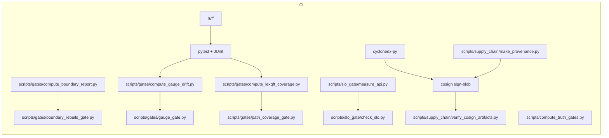
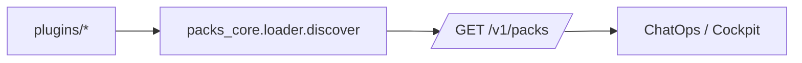

# Diagrams — CERTEUS

## Boundary Snapshot / Diff

```mermaid
flowchart TD
  A[data/public_pco/*.json] -->|hash| B[Shard assign (first 2 hex)]
  B --> C[Shard digest (SHA-256 of leaf digests)]
  C --> D[Global digest (concat shard-id + digest)]
  D --> E[out/boundary_snapshot.json]

  E1[BASE snapshot]:::snap --> F[boundary_diff]
  E2[HEAD snapshot]:::snap --> F
  F --> G{Identical?}
  G -- yes --> H[status: IDENTICAL]
  G -- no  --> I[status: DIFFERENT + shard diffs]

  classDef snap fill:#dde,stroke:#88a
```

## Proof Gate (CI) Pipeline



## Packs (Discovery)



## ProofFS & MailOps → Boundary

```mermaid
flowchart LR
  subgraph Ingest
    M[MailOps /ingest] --> N[Normalize MIME + Attachments]
    N --> DPCO[io.email.* + attachments]
  end
  subgraph ProofFS (RO)
    DPCO --> P[pfs://mail/<messageId>]
  end
  P --> E[Evidence DAG]
  E --> B[Boundary append-only]
  B --> R[Reconstruct / Verify]
```
