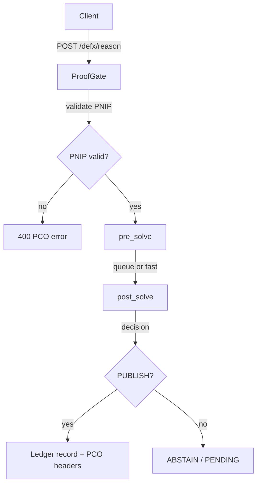

#!/usr/bin/env markdown

# Publish Flow (Mermaid)

```mermaid
flowchart TD
  A[Client] -->|POST /defx/reason| B[ProofGate]
  B -->|validate PNIP| C{PNIP valid?}
  C -- no --> E[400 PCO error]
  C -- yes --> D[pre_solve]
  D -->|queue or fast| F[post_solve]
  F -->|decision| G{PUBLISH?}
  G -- yes --> H[Ledger record + PCO headers]
  G -- no --> I[ABSTAIN / PENDING]
```
